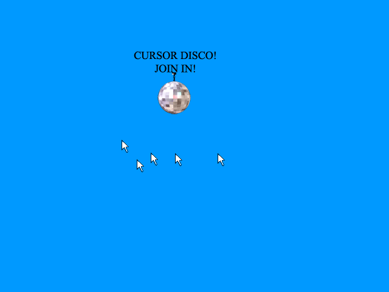

# Cursor Disco

Join in! `cursordisco` is a simple HTTP/websockets server which tracks users' cursors in real time and relays co-ordinates to all other users.



## Installing

With [npm](http://npmjs.org/):

```sh
$ npm install -g cursordisco
```

## Uninstalling

```sh
$ npm uninstall -g cursordisco
```

## Use

```sh
$ cursordisco
```

Then visit [localhost](http://localhost/).

## Options

### -h, --help

Display help information

### -V, --version

Display version information

### -p, --port

Listen on a specific port.

By default `cursordisco` will use `--port 80`.

`--port 0` will choose an available port at random.

## Errors

### Error: listen EADDRINUSE

The port is already in use. You must choose another port or kill the process which is listening to that port.

### Error: listen EACCES

You do not have permission to listen to this port. Most likely you are trying to listen to port 80 and do not have the necessary privileges. You can:

1. Use `sudo` (i.e. `$ sudo cursordisco --port 80`)
2. Use a reverse proxy or some other form of port forwarding